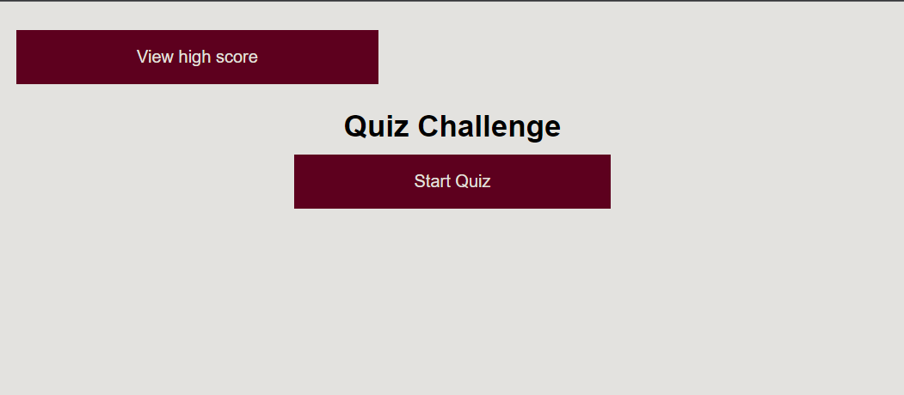
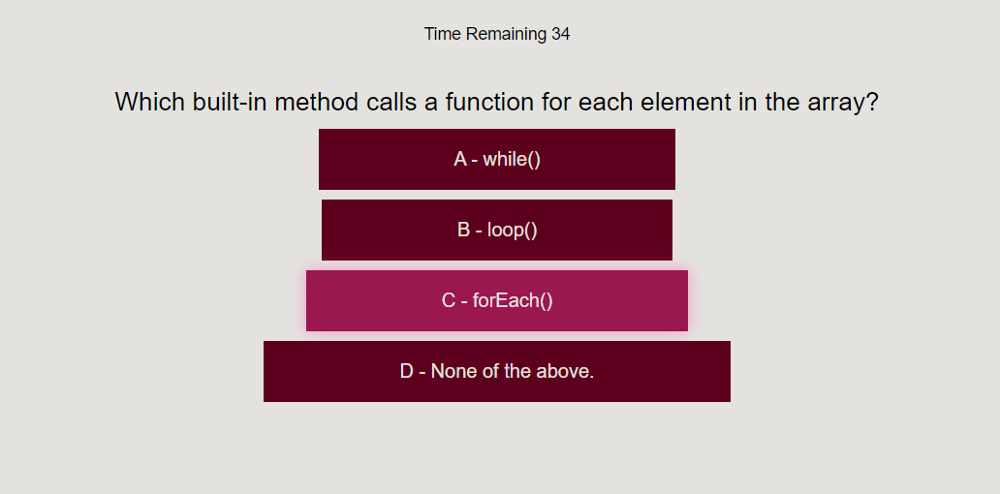
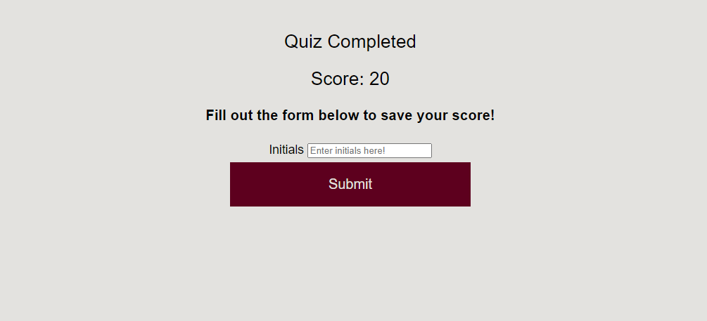
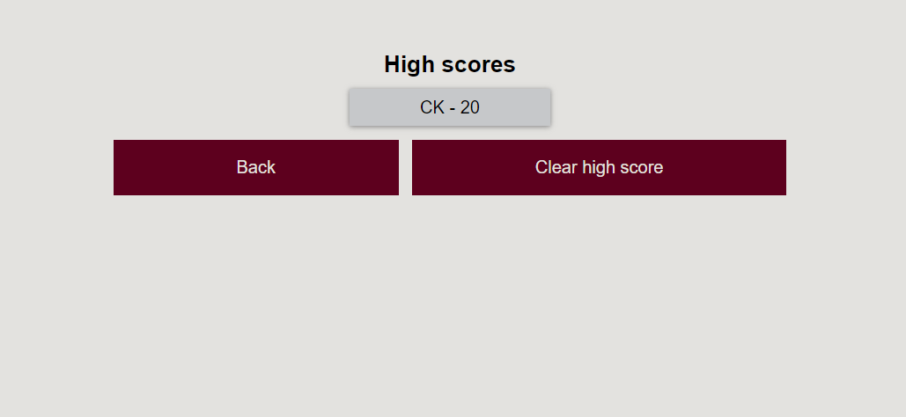
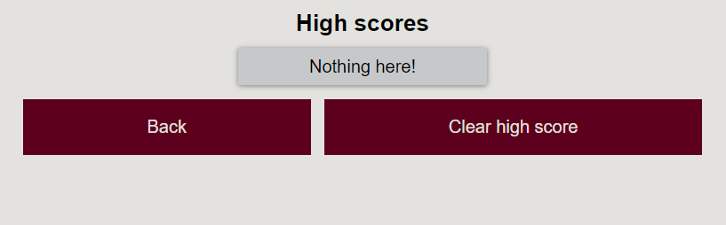

# JavaScript Quizler

## Description
---
JavaScript Quizler is a quiz application to show off your knowledge of basic JavaScript. The purpose of this application was to use javascript in conjuction with HTML and CSS to create a dynamically changing HTML page with simple and easy to navigate styling. When you press "Start Quiz," you are then presented with a few questions that change everytime you select an answer. At the end of the quiz, you are presented with a form to save your quiz score which can then later be viewed after submitting or clicking the "View High Score" button.

## Installation
---
N/A

## Usage
---
You will first be presented with this page when starting the application.

When you start the quiz you'll be given a question with four different answers. Choose an answer to proceed to the next question.

If all the questions are answered or time runs out, you are given a form to save your score.

Once you have entered your initials and submitted your score, you are then taken to a high score page where your quiz score has been saved.

If you wish to delete your score then you can press the "Clear high score" button to delete it. Hit the "Back" button to be taken back to the title page

# References

- Rene Trevino and Amir Hajizadeh helped write some of the code provided in this project

# Application URL

- https://cullenknott.github.io/quizler-meme/
